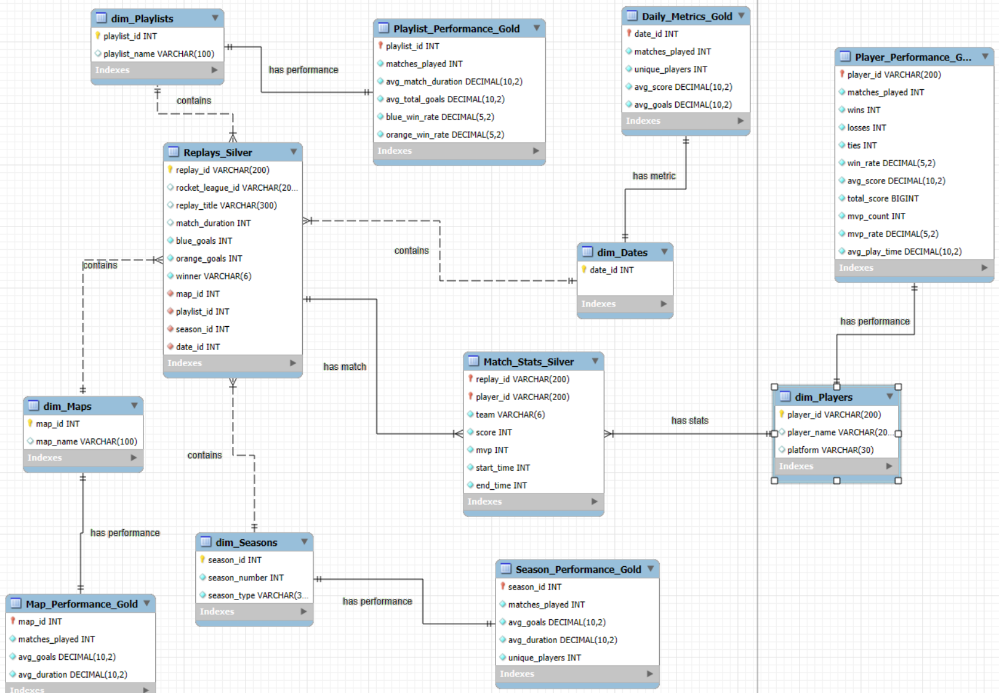

# Rocket League ETL Pipeline (Databricks + Azure + Python)

## Project Overview

This project is a **data engineering ETL pipeline** built to analyze Rocket League match replay data using **Microsoft Azure and Databricks**.

It demonstrates how raw API data can be ingested, processed, and transformed into analytics-ready datasets using a modern cloud data stack.

---

## Architecture

This pipeline follows a **Medallion Architecture** designed to progressively transform raw Rocket League replay data into analytics-ready datasets.

```text
Rocket League API
        ↓
Bronze Layer (Azure Blob Storage)
- Raw JSON replay data ingestion
- No transformations applied

        ↓
Silver Layer (Databricks - PySpark)
- Data cleaning and schema normalization
- Flattening nested replay/player structures
- Preparation for analytics

        ↓
Gold Layer (Databricks / Azure SQL)
- Aggregated player & match metrics
- Analytics-ready datasets for reporting
- Optimized for querying and dashboards
``` 

---

## Data Model (ERD)

The database contains both Silver and Gold layer tables following a Medallion architecture design.



# Silver Tables

- Replays
- Match Stats

These tables contain detailed replay level data used as the foundation for downstream analytics.

# Gold Tables


- dim_Players
- dim_Dates
- dim_Seasons
- dim_Playlists
- dim_Maps
- Player_Performance
- Season_Performance
- Map_Performance
- Playlist_Performance
- Daily_Metrics

These tables contain aggregated KPIs and metrics designed for Power BI reporting and performancew analysis.

---

## Tech Stack

- **Databricks (PySpark)** – Data processing and transformation
- **Microsoft Azure Blob Storage** – Raw data storage (Bronze layer)
- **Azure SQL Database** – Structured analytics storage
- **Python** – API integration + orchestration logic
- **Rocket League API (Ballchasing)** – Data source

---

## ETL Process

### 1. Data Ingestion (Extract)
- Pull replay data from the Ball Chasing (Rocket League) API
- Store raw JSON response

### 2. Load (Bronze Layer)
- Upload raw JSON files into Azure Blob Storage

### 3. Transform (Silver Layer)
- Read raw JSON into Databricks
- Flatten nested structures
- Clean and standardize schema

### 4. Gold Layer
- Aggregate player and match-level metrics
- Prepare datasets for analytics and dashboards

---

## Engineering Highlights

- Handles semi-structured JSON replay data with nested structures  
- Implements Medallion architecture for progressive data refinement  
- Uses PySpark in Databricks for distributed data processing  
- Separates raw, cleaned, and analytics-ready datasets for traceability  
- Designed for cloud-native scalability using Azure services  

---

## Data Flow Diagram

API → Blob Storage (Bronze) → Databricks (Silver) → SQL (Gold)

---

## Security Notice

This repository contains **sanitized and redacted code only**.

- API keys and credentials have been removed
- Environment-specific values are replaced with placeholders
- Actual execution requires a configured Databricks and Azure environment

---

## Execution Note

These notebooks are **exports from a Databricks workspace** and are intended for:

- Code review
- Architecture demonstration
- Portfolio presentation

They are **not directly runnable in a local environment without configuration setup**.

---

## Project Goals & Engineering Focus

This project was built to demonstrate real-world data engineering capabilities by designing and implementing a cloud-based ETL pipeline.

It focuses on solving practical engineering challenges such as:

- Ingesting raw semi-structured JSON data from external APIs  
- Designing a Medallion architecture for scalable data processing  
- Building transformation logic using PySpark in Databricks  
- Ensuring data traceability across all pipeline stages (Bronze → Silver → Gold)  
- Producing analytics-ready datasets for downstream reporting and insights  

This project simulates a production-style data workflow commonly used in modern cloud data engineering environments.

---

## Note

This project simulates production-style data workflows used in modern analytics engineering environments.
